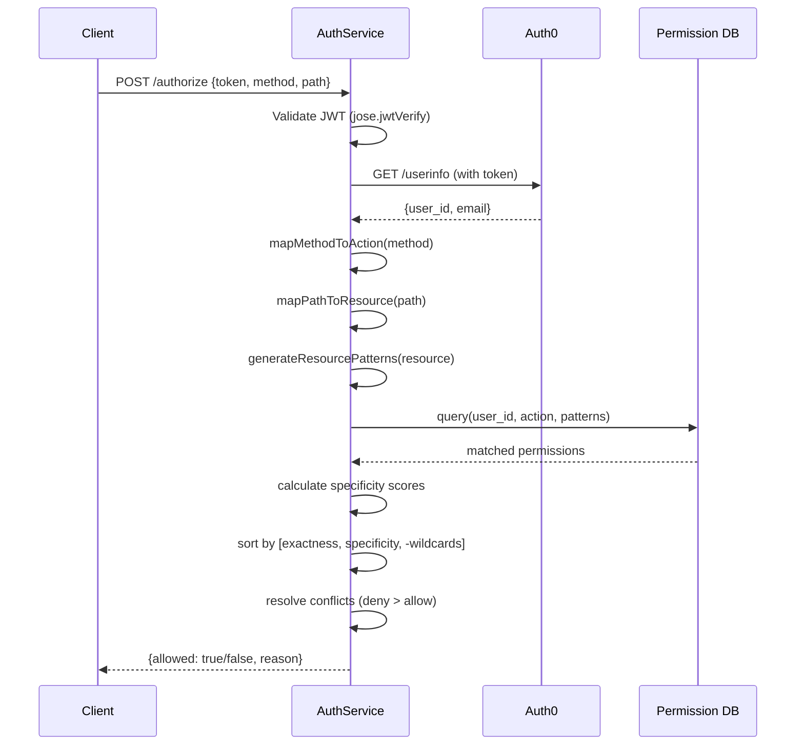

# 🔐 Authorization Service – Permission Resolution Approach

This service provides fine-grained **authorization** for API requests based on user identity, action, and resource.  
The main flow starts with the `/authorize` API and proceeds through token validation, resource mapping, permission lookup, and resolution.

---

## 1. Request Flow

The `/authorize` API receives a payload:

```json
{
  "access_token": "JWT_TOKEN",
  "method": "POST",
  "path": "/wallets/wallet-789/transactions/txn-456"
}
```

### Steps in the service layer:

1. **Validate JWT**  
   - Using [`jose`](https://github.com/panva/jose) and the `jwtVerify` method.  
   - Verification options include: `audience`, `issuer`, `algorithm`, and `clockTolerance`.

2. **Fetch User Info**  
   - Once the token is verified, make a REST call to Auth0’s `/userinfo` endpoint.  
   - Extract `user_id` and `email` for downstream checks.

3. **Map Method → Action**  
   - Example: `GET → read`, `POST, PUT, PATCH → write`, `DELETE → delete`.

4. **Map Path → Resource**  
   - Normalize the path by removing query params and trailing slashes.  
   - Example: `/wallets/wallet-789/transactions/txn-456` → `wallets/wallet-789/transactions/txn-456`.

At this point we have:
- **User**: `user_id`
- **Action**: derived from method
- **Resource**: derived from path

---

## 2. Permission Layer (Core Business Logic)

The **permission layer** applies the actual authorization rules.

### Step 1: Generate Resource Patterns  
From the resource, generate possible **wildcard patterns**.  
Example resource:  
```
wallets/wallet-789/transactions/txn-456
```

Generated patterns:
- `wallets/wallet-789/transactions/txn-456` (exact)  
- `wallets/wallet-789/transactions/*` (parent wildcard)  
- `wallets/wallet-789/*` (parent wildcard)  
- `wallets/*/transactions/*` (middle wildcard)  
- `wallets/*` (general wildcard)  
- `*` (global wildcard)  

---

### Step 2: Query Database  
Query for permissions matching:
- `user_id`
- `action`
- `resource ∈ [generated patterns]`

This retrieves all candidate permissions for the user.

---

### Step 3: Specificity Scoring  
Each matched permission is assigned a **specificity score** to determine precedence.

Scoring is done via a **tuple**:  
```
[exactness, specificity, -wildcards]
```

- **Exactness**: `1` if exact string match, else `0`.
- **Specificity**: number of non-wildcard segments.
- **-Wildcards**: fewer wildcards = higher value.

Examples:
- `users/123` (exact) → `[1, 2, 0]` (highest priority)  
- `users/123` (pattern) → `[0, 2, 0]`  
- `users/*` → `[0, 1, -1]`  
- `*` → `[0, 0, -∞]` (lowest priority)  

Sorting uses **lexicographic ordering**: more specific rules always beat generic ones.

---

### Step 4: Conflict Resolution  
With permissions sorted:

1. Take the **top (most specific) permission**.
2. If multiple permissions share the same score:
   - **Deny beats Allow** (for security).
3. If no permission matches, default to **Deny**.

---

## 3. Example Walkthrough

Request:
```http
POST /wallets/wallet-789/transactions/txn-456
```

User permissions in DB:
- `wallets/*/transactions/* → allow`
- `wallets/* → deny`

Generated patterns include both.  
Scoring ranks:
- `wallets/*/transactions/*` higher (more specific).  

Result: ✅ **Allow**.  

If instead DB had:
- `wallets/*/transactions/* → allow`
- `wallets/wallet-789/transactions/txn-456 → deny`

Then **deny** would win due to higher specificity at the same score level.  

---

## 4. Key Design Principles

- **Specificity wins** → more precise matches override general ones.
- **Deny overrides Allow** → safer default.
- **Wildcard support** → flexible, supports parent and middle wildcards.
- **Default deny** → if no rule matches, access is denied.

---

## 5. Diagrams

### 🔄 Authorization Flow



---

This document captures the **end-to-end authorization flow**:  
from token → user → resource → permissions → final decision.
